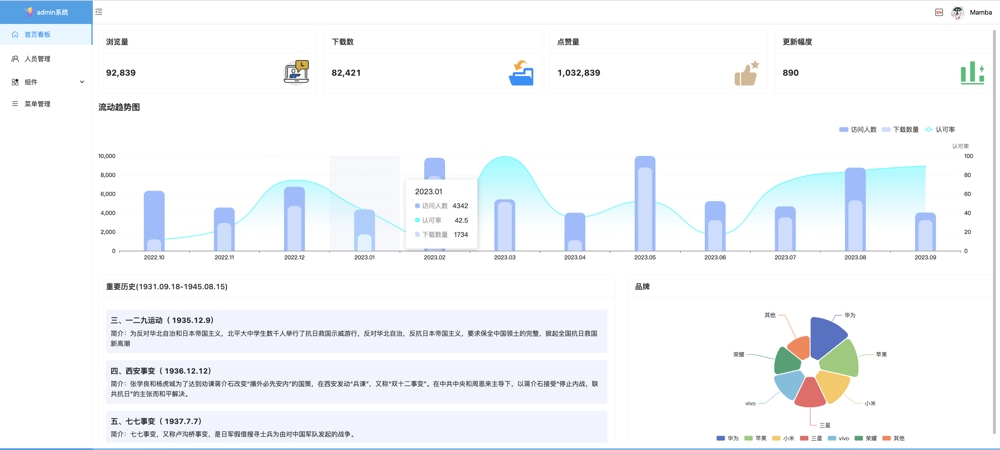

# vue3-PC-admin

vue3+vite+javascript+pina+ant-design-vue 实现的一个 pc 端后台管理系统，动态菜单，beautiful 登录页，首页，打造一个完美的可供使用的后台管理系统。

- Preview
<p  style="display:flex;flex-wrap: wrap;justify-content: space-between;">
    
    
    
    
    
    
</p>

- Get the project code

```bash
git clone https://github.com/lower-greenHand/vue3-PC-admin
```

- Installation dependencies

```
yarn 或 npm install 或 yarn install
```

- Run

```
yarn dev  或 npm run dev
```

- build

```
dev 环境
yarn build:dev

qa环境
yarn build:qa


pro
yarn build

```

<!--  https://cdn.jsdelivr.net/npm/tsparticles-plugin-polygon-mask@2.12.0/tsparticles.plugin.polygon-mask.min.js -->
